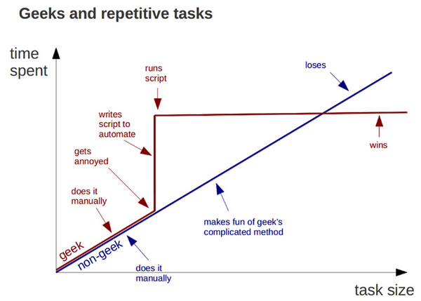

### What is this?

This is a shinyapp to return the results from multiple USAjobs.gov
searches, and filter by opening application date. Full code on
[github](https://github.com/sformel/USAjobs_gov_combo_search) and
example app below.

### Why?

Why would you want to do this? Well, the [USAjobs.gov
search](https://www.usajobs.gov/) is great, it allows you to search for
multiple keywords, and [sort by opening application
date](https://www.usajobs.gov/Help/how-to/search/sort/). However, the
only boolean operator it allows is an [implict “AND” between
keywords](https://www.usajobs.gov/Help/how-to/search/keyword/). There is
no option for “OR” and “NOT”. At least as far as I can tell.

Lately, I’ve been keeping an eye on jobs to take the next step in my
career. Which means I’ve been receiving daily automated search results
for six different searches. This meant that I was sometimes seeing the
same result twice (e.g. a job that hit for “Biology” and “Ecology”) and
it was up to me to figure out if it was exactly the same job or not. I
also didn’t have a way to filter out jobs I knew I wasn’t interested in.
For example, it’s highly unlikely I would be apply for anything with
“Medical” in the title. And there are a lot of medical jobs posted with
“Biology” as a keyword. Equally important, the way the emailed results
are set up, they only return 10 new postings since the previous day.
That means that I would have to navigate the to USAjobs.gov website to
see the full results, then sort the results by opening application date
because I couldn’t filter to just the jobs that had been posted in the
previous day.

If I didn’t find myself chasing a few children around every morning, it
might be a little easier to review these uncoordinated results over my
morning cup of coffee. But like any good nerd, I saw the opportunity to
invest a potentially silly amount of time into creating a slightly
better solution. I’ve heard from some friends that they would find this
helpful, so I’ve shared it here.

What I’ve done is create and R Shiny app that allows you to search
USAjobs.gov for:

1.  A list of keywords, with an implicit “OR”
2.  Filter out results using another list of keywords
3.  Specify how many days back you want to look, in terms of the
    application opening date.

To be clear, it only returns each result once, even if it is returned by
multiple searches.

Let me stress that this won’t be very useful for random searching. This
is just an efficient way to view the same group of search results every
day, so you can quickly catch any new postings that you might be
interested in applying for, across all your searches of interest. So get
your ducks in a row by searching on the USAjobs.gov website, and then
run this as frequently as you wish to see new results.

### How to use?

1.  Obtain an [API authorization key from
    USAjobs.gov](https://developer.usajobs.gov/APIRequest/Index). It
    will look super official, and your imposter syndrome will well up
    inside you making you question whether or not you are qualified for
    an authorization key. Swat those feelings away, and dsecribe your
    use as politely and succinctly as possible. Something like, “I will
    use the API to search for jobs for myself.”
2.  Download this script (NEED A LINK) into a folder on your computer
    (you may need to install some of these libraries).
3.  In that folder create a csv file that has a single line:
    your\_email, your\_USAjobs\_authorization\_key
4.  Run the script
5.  Select the “Search Panel”
6.  Click the “Select File” button and select the csv you made with the
    email and authorization key.
7.  Enter keywords to search for and keywords to filter out.
8.  Enter number of days since job was posted; 1 = yesterday, 2 = the
    day before yesterday, etc.
9.  Click the Search Button.
10. Look at results by clicking the panel “Search Results”

### Limitations

1.  The “days since job was posted” is strictly a calendar date, not 24
    hours.
2.  This app depends on the USAjobs API, and if you ping it too many
    times in a short period, it will pout for a while and not return any
    results. I could write in a sleep period into the app, but it wasn’t
    necessary for my needs.
3.  This app is a nice interface for someone who isn’t very comfy with
    R, but it is actually even a little more efficient to hard code your
    keywords into the script. And of course you can customize it to
    filter and display other data that you might be interested in.

### Example Search Results and User Interface

View app in full window
[here](https://sformel.shinyapps.io/usajobs_search/).

    ## PhantomJS not found. You can install it with webshot::install_phantomjs(). If it is installed, please make sure the phantomjs executable can be found via the PATH variable.

<iframe src="https://sformel.shinyapps.io/usajobs_search/?showcase=0" width="100%" height="400px" data-external="1">
</iframe>

### Full Code

For those who are interested. Other example code on
[github](https://github.com/sformel/USAjobs_gov_combo_search).

    library(httr)
    library(tidyverse)
    library(jsonlite)
    library(data.table)
    library(shiny)
    library(DT)

    ui <-  fluidPage( setBackgroundColor(
        color = c("#F7FBFF", "#b3d5f2"),
        gradient = "linear",
        direction = "bottom"
      ),
                     tabsetPanel(
                       tabPanel(title = "What is this voodoo?",
                                h3("I was looking for a job and then I found a job..."),
                                br(),
                                p("This R Shiny app allows you to search USAjobs.gov for:"),
                                br(),
                                ("1. A list of keywords, with an implicit 'OR' operator between them"),
                                br(),
                                ("2. Filter out results using another list of keywords"),
                                br(),
                                ("3. Specify how many days back you want to look, in terms of the application opening date."),
                                p(),
                                ("To be clear, it only returns each result once, even if it is returned by multiple searches."),
                                p(),
                                ("Let me stress that this won't be very useful for random searching.  This is just an efficient way to view the same group of search results every day, so you can quickly catch any new postings that you might be interested in applying for, across all your searches of interest.  So get your ducks in a row by searching on the USAjobs.gov website, and then run this as frequently as you wish to see new results.")),
        tabPanel("Search Panel",
                 fileInput("file", 
                    "User Info", 
                    buttonLabel = "Select File", accept = ".csv"),
          textInput("keywords", "Search for these words\n(separate with commas):", ""),
          textInput("skipwords", "Exclude jobs with this word in the title (separate with commas):", ""),
          numericInput("days", "Days since job was posted", 0, min = 0),
          actionButton("search", label = "Commencing Countdown, Engines On...Click to Search."),
         ),
        tabPanel(title = "Search Results",
                 DT::dataTableOutput("mytable"))
      )
    )

    server <- function(input, output) {
      
      login <- reactive({inFile <- input$file
      if (is.null(inFile))
          return(NULL)
      read.csv(inFile$datapath, header = FALSE)
      #print(read.csv(inFile$datapath, header = FALSE))
      })
      
      observeEvent(input$search, {
        post_days <- input$days
        KW_list <- strsplit(input$keywords,",|, ") %>% unlist()
        skip_list <- strsplit(input$skipwords,",|, ") %>% unlist()
        URL_list <- paste0("https://data.usajobs.gov/api/search?Keyword=",KW_list,"&ResultsPerPage=1000")
        
        #Looped requests
        GETfunc <- function (URL){
          GET(url = URL, 
              config = add_headers("Host" = "data.usajobs.gov", 
                             "User-Agent" = login()$V1,
                             "Authorization-Key" = login()$V2))
          }
        
        #Conduct Searches
        r.list <- lapply(URL_list, GETfunc)
        
        #Make into data frames
        df.list <- list()
        
        for (i in 1:length(r.list)){
          
          df.list[[i]] <- content(r.list[[i]], "text") %>% 
            fromJSON()
          }
        
        #Clean and organize
        results.list <- list()
        
        for (i in 1:length(df.list)){
          results.list[[i]] <- df.list[[i]]$SearchResult$SearchResultItems$MatchedObjectDescriptor %>% 
            filter(!(str_detect(tolower(PositionTitle), paste0(skip_list, collapse = "|"))), 
                   PositionStartDate > Sys.Date() - post_days) %>% #date minus 1.5 days 
            select(PositionID,
                   OrganizationName,
                   ApplyURI,
                   PositionTitle,
                   PositionLocation,
                   QualificationSummary,
                   UserArea)
          }
        
        #create final table (originally for xtable html)
        results.html.list <- list()
        
        #Subset to non-null results
        results.list <- results.list[lapply(results.list, nrow) %>%
                                       unlist() > 0]
        
        for (i in 1:length(results.list)){
          results.html.list[[i]] <- data.frame("Org" = results.list[[i]]$OrganizationName,
                                               "Title" = results.list[[i]]$PositionTitle,
                                               "Locations" = lapply(results.list[[i]]$PositionLocation, 
                                                                    function(x){
                                                                      x %>% 
                                                                        select(LocationName) %>%
                                                                        unlist() %>%
                                                                        paste(., collapse = "   •")
                                                                      }) %>%
                                                 unlist(),
                                               "Summary" = lapply(results.list[[i]]$UserArea$Details$MajorDuties,
                                                                  function(x){
                                                                    x %>%
                                                                      paste(., collapse = "  •")
                                                                    }) %>%
                                                 unlist(),
                                               "URL" = unlist(results.list[[i]]$ApplyURI) %>% 
                                                 paste("<a href=\"",.,"\">Link</a>")
          )
          }
        
        #Bind results and find unique
        done_zo <- rbindlist(results.html.list) %>% 
          unique.data.frame() %>% 
          arrange(Org)
        
        output$mytable = DT::renderDataTable({
        done_zo
      }, 
      escape = FALSE,
      )
      })
    }
      
    shinyApp(ui, server)
